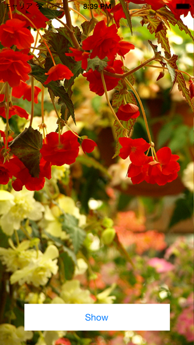
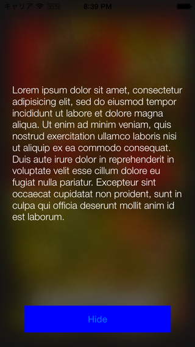

NRBlurryStepOutAnimatedTransitioning
====================================

A tweetbot 2 like modal view transitioning.
This module is an animated transitioning class which applies blur effect to step-backed view while modal view is presenting.

[Demo video](http://www.youtube.com/watch?v=DBhdKHwaGyw)

## Installation

Just add `NRBlurryStepOutAnimatedTransitioning.h,m` into your project.

### CocoaPods

Add below line into your `Podfile`:

	pod 'NRBlurryStepOutAnimatedTransitioning', '~> 0.1.0'

Then, run `$ pod install`

## Easy to use

In your header file, add `UIViewControllerTransitioningDelegate` protocol to your view controller class:

    @interface NRPresentedViewController : UIViewController<UIViewControllerTransitioningDelegate>
    @end

In your source file:

    #import "NRBlurryStepOutAnimatedTransitioning.h"

    -(void)showNewController;
    {
        UIViewController* vc = [[YourModalViewController alloc] init];
        vc.transitioningDelegate = self;
        [self presentViewController:vc animated:YES completion:NULL];
    }
    
    
    #pragma mark - UIViewControllerTransitioningDelegate
    
    - (id<UIViewControllerAnimatedTransitioning>)animationControllerForPresentedController:(UIViewController *)presented presentingController:(UIViewController *)presenting sourceController:(UIViewController *)source
    {
        return [[NRBlurryStepOutAnimatedTransitioning alloc] initWithPresenting:YES];
    }
    
    - (id <UIViewControllerAnimatedTransitioning>)animationControllerForDismissedController:(UIViewController *)dismissed
    {
        return [[NRBlurryStepOutAnimatedTransitioning alloc] initWithPresenting:NO];
    }

Invoke `-showNewController` from somewhere you like.
That's it :)

